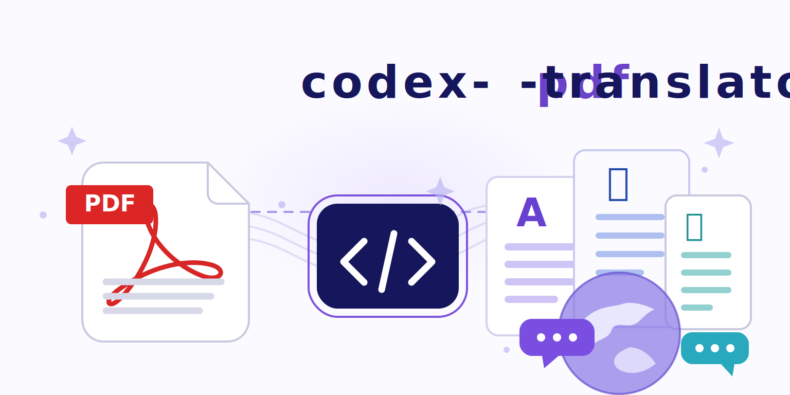

# Codex PDF Translator



PDF論文を、Codex CLIで日本語に翻訳して、読みやすいMarkdown/PDFにするツールです。

OpenAI APIキーをこのツールに入れる必要はありません。翻訳は、すでにログインしているローカルの `codex` CLIを使います。

おすすめの出力はこの2つです。

- `paper-ja.md`: 日本語本文 + 図表スクショ + 疑似コードスクショ
- `paper-ja.pdf`: そのMarkdownをPDF化した読みやすい版

表や疑似コードを無理にテキスト化せず、必要なところは画像として残すので、論文として読みやすい形になりやすいです。

## まずはこれ

```bash
uv venv
uv pip install -e ".[dev]"

codex-pdf-translate prepare path/to/paper.pdf --workdir runs/my-paper
codex-pdf-translate translate runs/my-paper --model gpt-5.4-mini
codex-pdf-translate merge runs/my-paper
codex-pdf-translate export-md runs/my-paper --output-dir runs/my-paper/output/markdown
codex-pdf-translate render-md-pdf \
  runs/my-paper/output/markdown/paper-ja.md \
  --output runs/my-paper/output/markdown/paper-ja.pdf
```

出力はここにできます。

```text
runs/my-paper/output/markdown/
  paper-ja.md
  paper-ja.html
  paper-ja.pdf
  assets/
```

## 必要なもの

- Python 3.10+
- `uv`
- Codex CLI
- PDF化したい場合は Chrome / Chromium / Brave / Edge のどれか

Codex CLIのログイン確認:

```bash
codex login status
```

未ログインなら、先にCodex CLIでログインしてください。

## インストール

このリポジトリの中で実行します。

```bash
uv venv
uv pip install -e ".[dev]"
```

確認:

```bash
codex-pdf-translate --help
```

`pip` だけで入れる場合:

```bash
python3 -m venv .venv
. .venv/bin/activate
python -m pip install -e ".[dev]"
```

## 使い方

ここでは `path/to/paper.pdf` を翻訳する例で説明します。

### 1. PDFを読み込む

```bash
codex-pdf-translate prepare path/to/paper.pdf --workdir runs/my-paper
```

`runs/my-paper/` に、PDFから取り出したテキストや座標情報が保存されます。

やり直す場合:

```bash
codex-pdf-translate prepare path/to/paper.pdf --workdir runs/my-paper --force
```

### 2. 翻訳する

```bash
codex-pdf-translate translate runs/my-paper --model gpt-5.4-mini
```

長い論文の場合は時間がかかります。途中まで試すなら:

```bash
codex-pdf-translate translate runs/my-paper --start 1 --limit 3
```

進捗確認:

```bash
codex-pdf-translate status runs/my-paper
```

### 3. 翻訳結果をまとめる

```bash
codex-pdf-translate merge runs/my-paper
```

これで `runs/my-paper/translations.json` ができます。

### 4. Markdownを作る

```bash
codex-pdf-translate export-md runs/my-paper --output-dir runs/my-paper/output/markdown
```

これで `paper-ja.md` と `assets/` ができます。

`assets/` には、図・表・疑似コードのスクリーンショットが入ります。Markdownでは普通の画像として表示されます。

### 5. PDFにする

```bash
codex-pdf-translate render-md-pdf \
  runs/my-paper/output/markdown/paper-ja.md \
  --output runs/my-paper/output/markdown/paper-ja.pdf
```

Chromeの場所を指定したい場合:

```bash
codex-pdf-translate render-md-pdf \
  runs/my-paper/output/markdown/paper-ja.md \
  --output runs/my-paper/output/markdown/paper-ja.pdf \
  --chrome "/Applications/Google Chrome.app/Contents/MacOS/Google Chrome"
```

## 何が作られるか

```text
runs/my-paper/
  source.pdf
  manifest.json
  chunks/
    chunk_0001.json
    chunk_0002.json
  translations/
    chunk_0001.json
    chunk_0002.json
  translations.json
  output/
    markdown/
      paper-ja.md
      paper-ja.html
      paper-ja.pdf
      assets/
        page-02-figure-01.png
        page-07-algorithm-01.png
```

`runs/` は生成物置き場です。公開repoに論文PDFや翻訳済み本文を入れたくない場合は、git管理しないままで大丈夫です。

## 便利なコマンド

翻訳をやり直す:

```bash
codex-pdf-translate translate runs/my-paper --force
```

Codexを呼ばずに、どんな処理をするかだけ見る:

```bash
codex-pdf-translate translate runs/my-paper --dry-run
```

Markdownではなく、直接PDFを作る:

```bash
codex-pdf-translate render runs/my-paper --mode bilingual
codex-pdf-translate render runs/my-paper --mode paper
codex-pdf-translate render runs/my-paper --mode overlay
```

直接PDFモードもありますが、表・数式・疑似コードが多い論文ではMarkdown経由のほうがおすすめです。

## 出力モード

- `export-md`: 一番おすすめ。日本語Markdownと画像assetsを作る
- `render-md-pdf`: Markdownを読みやすいPDFにする
- `bilingual`: 元PDF画像と翻訳文を左右に並べる
- `paper`: 翻訳文をPDFに再組版する
- `overlay`: 元PDFに翻訳文を重ねる

## 困ったとき

### `Chrome/Chromium was not found`

Chrome系ブラウザが見つかっていません。Chrome、Chromium、Brave、Edgeのどれかを入れるか、`--chrome` で場所を指定してください。

### `missing translation`

まだ翻訳されていないchunkがあります。

```bash
codex-pdf-translate status runs/my-paper
codex-pdf-translate translate runs/my-paper
codex-pdf-translate merge runs/my-paper
```

### 画像がPDFに入らない

Markdownと `assets/` の位置関係が崩れている可能性があります。`paper-ja.md` と `assets/` は同じディレクトリに置いてください。

### overlayが崩れる

`overlay` は元PDFの枠に日本語を押し込むので、長い文章では崩れやすいです。基本はMarkdown出力を使うのがおすすめです。

## 開発

```bash
uv run pytest
```
